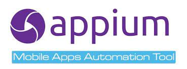

# Proyecto Automatizacion General Store


<p align="center">

[

  <a href="https://serenity-bdd.github.io/theserenitybook/latest/index.html"> 
   
  </a>
  <a href="https://cucumber.io/"> 
   
  </a>
  <a href="https://www.selenium.dev/"> 
   
  </a>
  <a href="https://gradle.org/"> 
   
  </a> 
</p>


- Acceder a la vpn en caso de trabajo desde casa conectada y activa
- Acceder a la url del proyecto https://gitlab.eltiempo.com.co/calidad-qa/eltiempo
- Seleccionar la opción "Clone" usar en la lista "Clone with https"
- Copiar el link del vinculo :  http://gitlab.eltiempo.com.co/calidad-qa/eltiempo.git
- Usar una herramienta para conectar y descargar el proyecto, ejemplo Gitbash.


Git global setup
```sh
git config --global user.name "Hervin Camargo Carlier"
git config --global user.email "hcamargo@eltiempo.com"
```
Crear un nuevo repositorio
```sh
git clone http://gitlab.eltiempo.com.co/calidad-qa/eltiempo.git
cd eltiempo
touch README.md
git add README.md
git commit -m "add README"
git push -u origin master
```
Comando Push en proyecto existente
```sh
cd eltiempo
git init
git remote add origin http://gitlab.eltiempo.com.co/calidad-qa/eltiempo.git
git add .
git commit -m "Initial commit"
git push -u origin master
```
Como ejecutar el proyecto

| Ruta | Acción |
| ------ | ------ |
| \src\test\java\com\eltiempo\runners | ejecutar el runner de la funcionalidad, dando clic derecho sobre la clase|
| Consola cmd en la raíz del proyecto | ejecutar comando: gradle clean test -Dtags=nombreTag , el nombre del tag se encuentra en el feature anterior a la definición del escenario. |
|https://jenkins.eltiempo.com.co/login?from=%2F|Seleccionar el job "Automation-ElTiempo", seleccionar la opción Build with Parameters, luego el nombre del tag (nombre que representa el caso de prueba), stage(ambiente), action: gradle_build

# Licencias

MIT
Open-Source

**Free Software!**